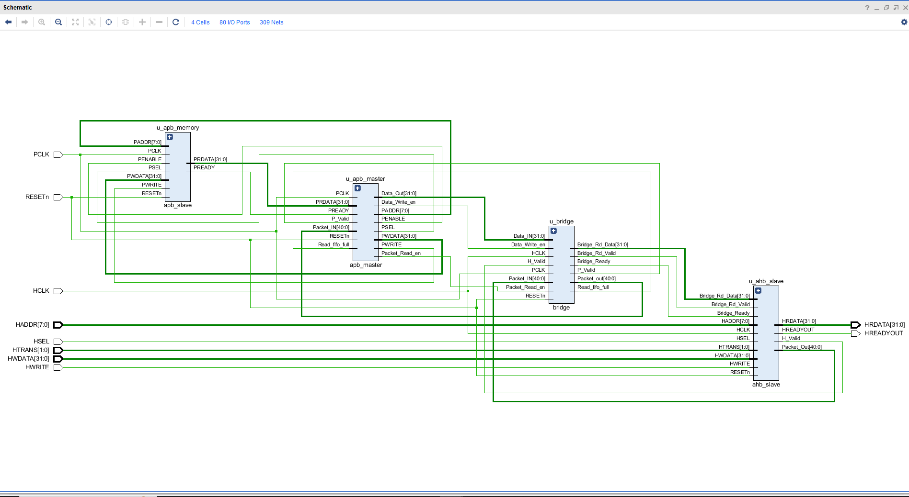
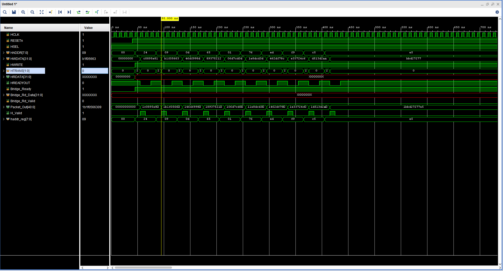
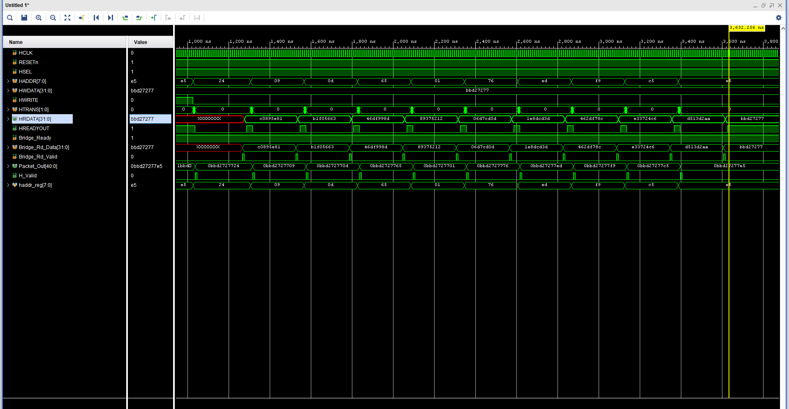
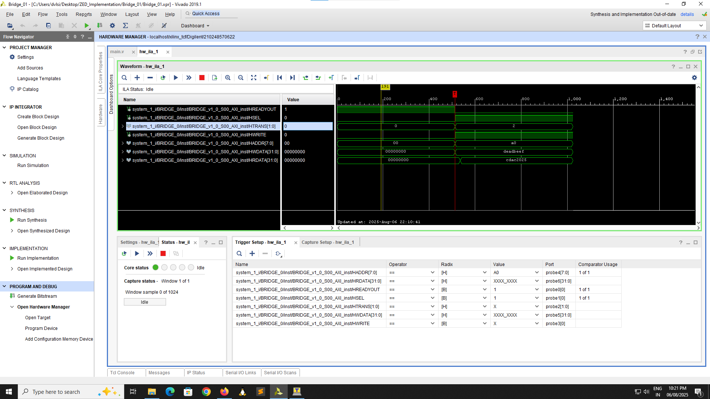
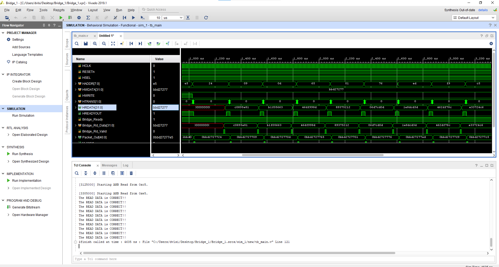
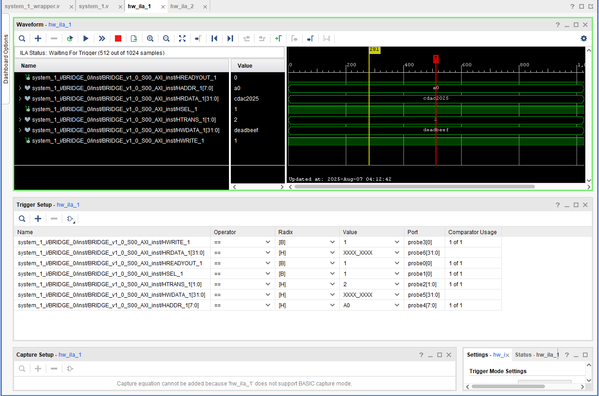
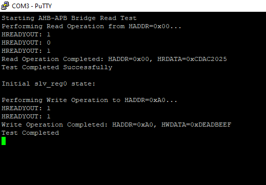

# Design and Implementation of an AMBA AHB-to-APB Bridge

## 📖 Project Overview

This project details the complete Register-Transfer Level (RTL) design and hardware implementation of a synthesizable **AHB-to-APB Bridge**.  
In modern System-on-Chip (SoC) designs, the Advanced Microcontroller Bus Architecture (AMBA) is a standard for on-chip communication.  
It defines protocols like the Advanced High-performance Bus (AHB) for high-speed modules (e.g., processors, DMA) and the Advanced Peripheral Bus (APB) for low-bandwidth peripherals (e.g., UART, timers).  

The AHB-to-APB bridge is an essential infrastructure component that enables a high-speed AHB master to communicate seamlessly with slower APB slaves.  
This design acts as an AHB slave, accepting transactions, and as an APB master, driving those transactions to the target peripheral.  
A key feature of this bridge is its ability to handle asynchronous clock domains, ensuring robust data transfer between the high-frequency AHB domain (`HCLK`) and the low-frequency APB domain (`PCLK`).

---

## 🏗️ System Architecture and Design

The bridge is architected as a set of modular and interconnected Verilog components.  
The top-level `main.v` module instantiates the AHB slave interface, the bridge core, the APB master interface, and a sample APB slave memory.

### Module Descriptions

#### 🔹 `ahb_slave.v`
This module serves as the front-end interface to the AHB bus. Its primary responsibilities are:
* **Transaction Detection**: Monitors `HSEL` and `HTRANS` to detect a valid transfer request.
* **Data Capture**: Captures the address (`HADDR`), write data (`HWDATA`), and control signals (`HWRITE`).
* **Packetization**: Formats this information into a 41-bit packet `{HWRITE, HWDATA, HADDR}` and asserts `H_Valid` to send to the bridge.
* **Stalling**: Uses `Bridge_Ready` as backpressure, stalling the AHB master by de-asserting `HREADYOUT` if the FIFO is full.

---

#### 🔹 `bridge.v`
This is the core of the design, responsible for synchronization and decoupling between the AHB and APB domains. It consists of:
* **Request FIFO (`WRITE_FIFO`)**: Asynchronous FIFO passing the 41-bit packet from `ahb_slave` (HCLK domain) to `apb_master` (PCLK domain).
* **Response FIFO (`READ_FIFO`)**: Asynchronous FIFO that transfers read data from the `apb_master` (PCLK domain) back to the `ahb_slave` (HCLK domain).

---

#### 🔹 `apb_master.v`
This module reads packets from the bridge and drives the APB bus. It uses a three-state FSM:
* **`IDLE`**: Waits for a valid transaction request (`P_Valid`) from the bridge FIFO.
* **`SETUP`**: A single-cycle state where it asserts `PSEL` and places `PADDR`, `PWDATA`, and `PWRITE` on the APB bus.
* **`ACCESS`**: Asserts `PENABLE` and holds signals until the APB slave responds with `PREADY`. For a read, it writes `PRDATA` into the response FIFO.

---

#### 🔹 `apb_slave.v`
This is a simple memory model acting as a target peripheral on the APB bus:
* Implements a **256x32-bit memory array**.
* When `PSEL` and `PENABLE` are high:
  * If `PWRITE=1` → Stores `PWDATA` at `PADDR`.
  * If `PWRITE=0` → Provides data on `PRDATA`.
* Includes a programmable wait counter to simulate slow peripherals.

---

### Clock Domain Crossing (CDC)

Robust transfer between `HCLK` and `PCLK` domains is ensured by asynchronous FIFOs:
* **Request path**: Written by HCLK, read by PCLK.
* **Response path**: Written by PCLK, read by HCLK.
* Uses Gray-code pointers to prevent metastability and guarantee safe synchronization.

---

## 🔬 Implementation and Verification

### Simulation-Based Verification
Initial verification was done with a Verilog testbench (`tb_main.v`):
* **Architecture**: Instantiates the DUT and generates `HCLK` and `PCLK` (2:1 frequency ratio).
* **Transaction Generation**: Includes `write_trans` and `read_trans` tasks to model an AHB master.
* **Self-Checking**: Maintains a local memory model. After writes, it performs reads and automatically checks correctness of returned data.

### FPGA Prototyping and Hardware Verification
The design was implemented on a **Xilinx Zynq-7000 ZedBoard**:
* **IP Packaging**: Encapsulated in a custom IP with AXI4-Lite interface.
* **PS-PL Integration**: Connected Processing System (PS) to Programmable Logic (PL) via AXI Interconnect.
* **Software Control**: C program on ARM Cortex-A9 initiated AHB transactions and displayed results over UART.
* **Debugging**: Xilinx Integrated Logic Analyzer (ILA) monitored internal signals in real time.

---

## 🛠️ Tools Used

* **Simulation & Implementation**: Xilinx Vivado Design Suite  
* **Hardware Platform**: Digilent ZedBoard (Zynq-7000)

---
## 📊 Results

### Simulation Waveforms

Write Transaction: AHB write propagates to APB. 

Read Transaction: APB read data returns to AHB. 

### Hardware Results

#### ILA Waveform: Captures AHB write/read in hardware. 

##### UART Output: Console output from Zedboard. (images/hardware_output.png)

## Conclusion

This AHB-to-APB bridge is a robust, synthesizable IP for SoC designs, efficiently bridging high-performance and low-power domains. Future enhancements could include support for AHB burst transfers or APB error handling.

## References

AMBA 2 Specification (ARM).

Clock Domain Crossing Techniques, SNUG Proceedings, 2008.

For issues or contributions, please open a pull request!

